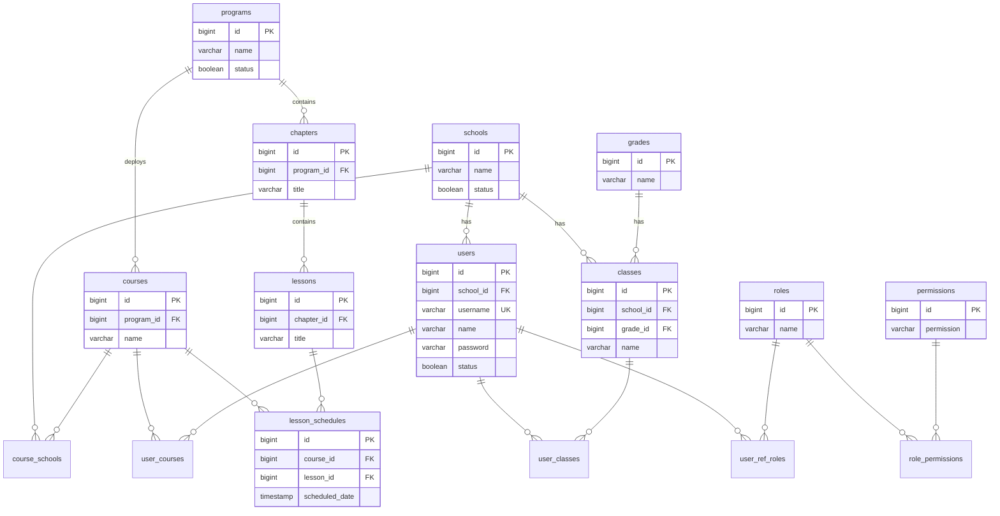
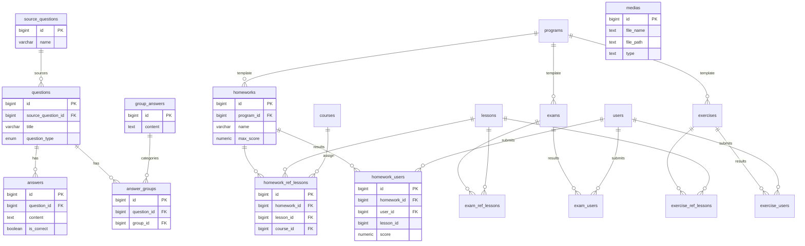
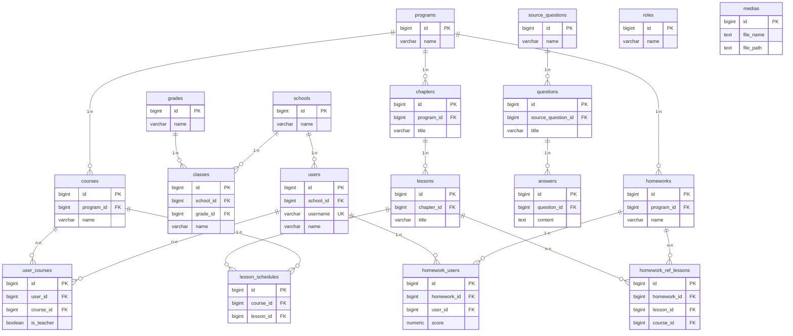

# ERD CleverSchool — Tài liệu cho đồ án tốt nghiệp

Tổng hợp từ schema thật (`be/database/migrations`, `tables-reference.md`). Chỉ gồm **các bảng cốt lõi** phục vụ hệ thống quản lý học tập và giảng dạy — không liệt kê bảng phụ (contest, HR, chat, SCORM chi tiết, …).

**Gợi ý chia slide:** 2 ERD riêng (xem mục 6) hoặc 1 ERD tổng quan rút gọn (mục 5).

---

## 1. Danh sách bảng (phiên bản chi tiết)

Chú thích: `PK` = khóa chính, `FK` = khóa ngoại, `UQ` = unique, `∅` = nullable.

---

### Group 1 — User & Permission

#### users
| Cột | Kiểu | Ràng buộc |
|-----|------|-----------|
| id | BIGSERIAL | **PK** |
| school_id | BIGINT | **FK** → schools.id, ∅ |
| username | VARCHAR(100) | **UQ** |
| name | VARCHAR(255) | NOT NULL |
| password | VARCHAR(255) | NOT NULL |
| email | VARCHAR(255) | ∅ |
| phone_number | VARCHAR(50) | ∅ |
| status | BOOLEAN | NOT NULL, default FALSE |
| avatar_info | JSONB | ∅ |
| created_at, updated_at | TIMESTAMP | |
| deleted_at | TIMESTAMP | soft delete |

**Ý nghĩa:** Lưu tài khoản Admin, Nhà trường, Giáo viên, Học sinh.

#### roles
| Cột | Kiểu | Ràng buộc |
|-----|------|-----------|
| id | BIGSERIAL | **PK** |
| name | VARCHAR(50) | NOT NULL |
| parent_id | BIGINT | default 0 |
| default_page_view | VARCHAR(50) | NOT NULL |
| status | BOOLEAN | NOT NULL |
| deleted_at | TIMESTAMP | soft delete |

**Ý nghĩa:** Vai trò hệ thống (Admin, Teacher, Student, School, …).

#### permissions
| Cột | Kiểu | Ràng buộc |
|-----|------|-----------|
| id | BIGSERIAL | **PK** |
| group | VARCHAR(100) | NOT NULL |
| name | VARCHAR(100) | NOT NULL |
| permission | VARCHAR(255) | NOT NULL (dạng `resource.action`) |
| is_display | BOOLEAN | default TRUE |

**Ý nghĩa:** Quyền thao tác trên từng module API.

#### role_permissions `[BẢNG TRUNG GIAN]`
| Cột | Kiểu | Ràng buộc |
|-----|------|-----------|
| role_id | BIGINT | **PK**, **FK** → roles.id |
| permission_id | BIGINT | **PK**, **FK** → permissions.id |

**Ý nghĩa:** Liên kết **roles ↔ permissions** (n–n).

#### user_ref_roles `[BẢNG TRUNG GIAN]`
| Cột | Kiểu | Ràng buộc |
|-----|------|-----------|
| id | BIGSERIAL | **PK** |
| user_id | BIGINT | **FK** → users.id, NOT NULL |
| role_id | BIGINT | **FK** → roles.id, NOT NULL |
| | | **UQ** (user_id, role_id) |

**Ý nghĩa:** Liên kết **users ↔ roles** (n–n).

---

### Group 2 — Academic Structure

#### schools
| Cột | Kiểu | Ràng buộc |
|-----|------|-----------|
| id | BIGSERIAL | **PK** |
| name | VARCHAR(255) | |
| type | TEXT | NOT NULL, default 'school' |
| status | BOOLEAN | NOT NULL |
| parent_school_id | BIGINT | **FK** → schools.id, ∅ |
| deleted_at | TIMESTAMP | soft delete |

**Ý nghĩa:** Trường học / trung tâm đào tạo.

#### grades
| Cột | Kiểu | Ràng buộc |
|-----|------|-----------|
| id | BIGSERIAL | **PK** |
| name | VARCHAR(255) | NOT NULL |
| number | INT | (migration 0039) |
| status | BOOLEAN | |

**Ý nghĩa:** Khối lớp (Khối 1–12).

#### classes
| Cột | Kiểu | Ràng buộc |
|-----|------|-----------|
| id | BIGSERIAL | **PK** |
| school_id | BIGINT | **FK** → schools.id |
| grade_id | BIGINT | **FK** → grades.id, ∅ |
| name | VARCHAR(255) | NOT NULL |
| status | BOOLEAN | |
| max_students | INT | |
| deleted_at | TIMESTAMP | soft delete |

**Ý nghĩa:** Lớp học thuộc trường.

#### user_classes `[BẢNG TRUNG GIAN]`
| Cột | Kiểu | Ràng buộc |
|-----|------|-----------|
| user_id | BIGINT | **PK**, **FK** → users.id |
| class_id | BIGINT | **PK**, **FK** → classes.id |
| is_main | BOOLEAN | |

**Ý nghĩa:** Liên kết **users ↔ classes** (HS/GV thuộc lớp nào).

#### programs
| Cột | Kiểu | Ràng buộc |
|-----|------|-----------|
| id | BIGSERIAL | **PK** |
| name | VARCHAR(255) | NOT NULL |
| description | TEXT | |
| duration | INT | |
| status | BOOLEAN | |
| deleted_at | TIMESTAMP | soft delete |

**Ý nghĩa:** Chương trình học — **mẫu nội dung gốc** (chương, bài, bài tập mẫu).

#### chapters
| Cột | Kiểu | Ràng buộc |
|-----|------|-----------|
| id | BIGSERIAL | **PK** |
| program_id | BIGINT | **FK** → programs.id, ∅ |
| course_id | BIGINT | **FK** → courses.id, ∅ (legacy) |
| title | VARCHAR(255) | |
| description | TEXT | |
| sort_position | INT | |
| status | BOOLEAN | |
| deleted_at | TIMESTAMP | soft delete |

**Ý nghĩa:** Chương trong chương trình. Nội dung bài học thuộc **program** (`program_id`); `course_id` là trường legacy.

#### lessons
| Cột | Kiểu | Ràng buộc |
|-----|------|-----------|
| id | BIGSERIAL | **PK** |
| chapter_id | BIGINT | **FK** → chapters.id, ∅ (migration 0034) |
| title | VARCHAR(255) | |
| description | TEXT | |
| status | BOOLEAN | |
| sort_position | INT | |
| author_id | BIGINT | |
| deleted_at | TIMESTAMP | soft delete |

**Ý nghĩa:** Bài học trong chương.

#### courses
| Cột | Kiểu | Ràng buộc |
|-----|------|-----------|
| id | BIGSERIAL | **PK** |
| program_id | BIGINT | **FK** → programs.id, ∅ |
| subject_id | BIGINT | **FK** → subjects.id, ∅ |
| name | VARCHAR(255) | NOT NULL |
| description | TEXT | |
| state | course_state | NOT NULL (coming/active/…) |
| start_date, end_date | TIMESTAMP | |
| deleted_at | TIMESTAMP | soft delete |

**Ý nghĩa:** Khóa học triển khai từ chương trình — dùng để **giao bài** và quản lý HS/GV theo khóa.

#### course_schools `[BẢNG TRUNG GIAN]`
| Cột | Kiểu | Ràng buộc |
|-----|------|-----------|
| id | BIGSERIAL | **PK** |
| course_id | BIGINT | **FK** → courses.id, NOT NULL |
| school_id | BIGINT | **FK** → schools.id, NOT NULL |
| | | **UQ** (course_id, school_id) |

**Ý nghĩa:** Liên kết **courses ↔ schools** (khóa học mở tại trường nào).

#### user_courses `[BẢNG TRUNG GIAN]`
| Cột | Kiểu | Ràng buộc |
|-----|------|-----------|
| id | BIGSERIAL | **PK** |
| user_id | BIGINT | **FK** → users.id, NOT NULL |
| course_id | BIGINT | **FK** → courses.id, NOT NULL |
| is_teacher | BOOLEAN | |
| main_teacher | BOOLEAN | |
| is_current | BOOLEAN | |
| start_time, end_time | TIMESTAMP | |

**Ý nghĩa:** Liên kết **users ↔ courses** (HS/GV tham gia khóa học).

#### lesson_schedules
| Cột | Kiểu | Ràng buộc |
|-----|------|-----------|
| id | BIGSERIAL | **PK** |
| course_id | BIGINT | **FK** → courses.id, NOT NULL |
| lesson_id | BIGINT | **FK** → lessons.id, NOT NULL |
| week_id | BIGINT | **FK** → weeks.id, ∅ |
| scheduled_date | TIMESTAMP | NOT NULL |
| sort_position | INT | |

**Ý nghĩa:** Xếp bài học theo tuần / lịch trong khóa học.

---

### Group 3 — Question Bank

#### source_questions
| Cột | Kiểu | Ràng buộc |
|-----|------|-----------|
| id | BIGSERIAL | **PK** |
| name | VARCHAR(255) | |
| deleted_at | TIMESTAMP | soft delete |

**Ý nghĩa:** Nguồn / bộ đề câu hỏi gốc.

#### questions
| Cột | Kiểu | Ràng buộc |
|-----|------|-----------|
| id | BIGSERIAL | **PK** |
| source_question_id | BIGINT | **FK** → source_questions.id, ∅ |
| subject_id | BIGINT | **FK** → subjects.id, ∅ |
| question_type | question_type_enum | NOT NULL |
| kind | kind_enum | NOT NULL |
| title | VARCHAR(500) | |
| content | TEXT | |
| point | NUMERIC(10,2) | |
| status | BOOLEAN | |
| deleted_at | TIMESTAMP | soft delete |

**Ý nghĩa:** Câu hỏi trong ngân hàng (trắc nghiệm, điền khuyết, ghép cặp, …).

#### answers
| Cột | Kiểu | Ràng buộc |
|-----|------|-----------|
| id | BIGSERIAL | **PK** |
| question_id | BIGINT | **FK** → questions.id |
| content | TEXT | |
| is_correct | BOOLEAN | |
| kind | kind_enum | NOT NULL |
| point | NUMERIC(10,2) | |
| sort_position | INT | |

**Ý nghĩa:** Đáp án / lựa chọn của câu hỏi trắc nghiệm.

#### group_answers
| Cột | Kiểu | Ràng buộc |
|-----|------|-----------|
| id | BIGSERIAL | **PK** |
| content | TEXT | |
| kind | kind_enum | NOT NULL |
| sort_position | INT | |

**Ý nghĩa:** **Danh mục** (category) cho câu hỏi dạng phân loại — header nhóm đáp án.

#### answer_groups
| Cột | Kiểu | Ràng buộc |
|-----|------|-----------|
| id | BIGSERIAL | **PK** |
| question_id | BIGINT | **FK** → questions.id, NOT NULL |
| group_id | BIGINT | **FK** → group_answers.id |
| content | TEXT | |
| kind | kind_enum | NOT NULL |
| point | NUMERIC(10,2) | |
| sort_position | INT | |

**Ý nghĩa:** Mục đáp án gán vào danh mục (`group_answers`).

#### cloned_questions
| Cột | Kiểu | Ràng buộc |
|-----|------|-----------|
| id | BIGSERIAL | **PK** |
| program_id | BIGINT | |
| assignment_id | BIGINT | NOT NULL |
| assignment_type | VARCHAR(50) | NOT NULL |
| questions | JSONB | NOT NULL |

**Ý nghĩa:** Bản sao câu hỏi gắn vào bài KT/BTVN/luyện tập (polymorphic qua `assignment_id` + `assignment_type`).

---

### Group 4 — Assignment & Result

#### homeworks
| Cột | Kiểu | Ràng buộc |
|-----|------|-----------|
| id | BIGSERIAL | **PK** |
| program_id | BIGINT | **FK** → programs.id, ∅ |
| name | VARCHAR(255) | |
| description | TEXT | |
| max_score | NUMERIC(10,2) | |
| total_questions | INT | |
| assigned_by | BIGINT | |
| deleted_at | TIMESTAMP | soft delete |

**Ý nghĩa:** Bài tập về nhà (BTVN) — mẫu thuộc chương trình.

#### exams
| Cột | Kiểu | Ràng buộc |
|-----|------|-----------|
| id | BIGSERIAL | **PK** |
| program_id | BIGINT | **FK** → programs.id, ∅ |
| name | VARCHAR(255) | |
| time_limit | BIGINT | |
| max_score | NUMERIC(10,2) | |
| deadline | TIMESTAMP | |
| deleted_at | TIMESTAMP | soft delete |

**Ý nghĩa:** Bài kiểm tra.

#### exercises
| Cột | Kiểu | Ràng buộc |
|-----|------|-----------|
| id | BIGSERIAL | **PK** |
| program_id | BIGINT | **FK** → programs.id, ∅ |
| name | VARCHAR(255) | |
| time_limit | BIGINT | |
| max_score | NUMERIC(10,2) | |
| deleted_at | TIMESTAMP | soft delete |

**Ý nghĩa:** Bài luyện tập trong bài học.

#### homework_ref_lessons `[BẢNG TRUNG GIAN]`
| Cột | Kiểu | Ràng buộc |
|-----|------|-----------|
| id | BIGSERIAL | **PK** |
| homework_id | BIGINT | **FK** → homeworks.id, NOT NULL |
| lesson_id | BIGINT | **FK** → lessons.id, NOT NULL |
| course_id | BIGINT | **FK** → courses.id, ∅ |
| assigned_by | BIGINT | |
| | | UQ partial theo mức CT/khóa |

**Ý nghĩa:** Liên kết **homeworks ↔ lessons** (và tùy chọn theo **course** khi giao bài).

#### exam_ref_lessons `[BẢNG TRUNG GIAN]`
Cấu trúc tương tự `homework_ref_lessons` với `exam_id` → exams.id.

#### exercise_ref_lessons `[BẢNG TRUNG GIAN]`
Cấu trúc tương tự với `exercise_id` → exercises.id.

**Ghi chú giao bài:** `course_id IS NULL` = mức chương trình (mẫu); `course_id` = id khóa = giao cho khóa cụ thể.

#### homework_users
| Cột | Kiểu | Ràng buộc |
|-----|------|-----------|
| id | BIGSERIAL | **PK** |
| homework_id | BIGINT | **FK** → homeworks.id, NOT NULL |
| lesson_id | BIGINT | NOT NULL |
| user_id | BIGINT | **FK** → users.id, NOT NULL |
| score | NUMERIC(5,2) | |
| ratio | NUMERIC(7,2) | |
| status_scoring | SMALLINT | |

**Ý nghĩa:** Kết quả nộp BTVN của học sinh (tổng hợp theo bài + bài học).

#### exam_users
Cấu trúc tương tự với `exam_id` → exams.id, thêm `time`.

#### exercise_users
Cấu trúc tương tự với `exercise_id` → exercises.id, thêm `time`.

**Ghi chú:** Chi tiết từng câu lưu ở `*_question_users` và `*_question_user_*` (không vẽ trong ERD slide).

---

### Group 5 — Media

#### medias
| Cột | Kiểu | Ràng buộc |
|-----|------|-----------|
| id | BIGSERIAL | **PK** |
| parent_id | BIGINT | (cây thư mục) |
| file_name | TEXT | NOT NULL |
| file_path | TEXT | NOT NULL |
| file_type | TEXT | |
| file_size | BIGINT | |
| type | TEXT | NOT NULL ('file' \| 'folder') |
| disk_name | TEXT | |
| static_url | TEXT | |
| deleted_at | TIMESTAMP | soft delete |

**Ý nghĩa:** File học liệu (ảnh, video, tài liệu) — lưu trữ local hoặc S3.

---

## 2. Quan hệ giữa các bảng

### 2.1 Liệt kê FK (dạng `table.column → table.column`)

```
users.school_id              → schools.id
classes.school_id            → schools.id
classes.grade_id             → grades.id
user_classes.user_id         → users.id
user_classes.class_id        → classes.id
user_ref_roles.user_id       → users.id
user_ref_roles.role_id       → roles.id
role_permissions.role_id     → roles.id
role_permissions.permission_id → permissions.id
courses.program_id           → programs.id
courses.subject_id           → subjects.id
course_schools.course_id     → courses.id
course_schools.school_id     → schools.id
chapters.program_id          → programs.id
chapters.course_id           → courses.id
lessons.chapter_id           → chapters.id
user_courses.user_id         → users.id
user_courses.course_id       → courses.id
lesson_schedules.course_id   → courses.id
lesson_schedules.lesson_id   → lessons.id
questions.source_question_id → source_questions.id
questions.subject_id         → subjects.id
answers.question_id          → questions.id
answer_groups.question_id    → questions.id
answer_groups.group_id       → group_answers.id
homeworks.program_id         → programs.id
exams.program_id             → programs.id
exercises.program_id         → programs.id
homework_ref_lessons.homework_id → homeworks.id
homework_ref_lessons.lesson_id   → lessons.id
homework_ref_lessons.course_id   → courses.id
exam_ref_lessons.exam_id     → exams.id
exam_ref_lessons.lesson_id   → lessons.id
exam_ref_lessons.course_id   → courses.id
exercise_ref_lessons.exercise_id → exercises.id
exercise_ref_lessons.lesson_id   → lessons.id
exercise_ref_lessons.course_id   → courses.id
homework_users.homework_id   → homeworks.id
homework_users.user_id       → users.id
exam_users.exam_id           → exams.id
exam_users.user_id           → users.id
exercise_users.exercise_id   → exercises.id
exercise_users.user_id       → users.id
```

### 2.2 Cardinality (bản chất quan hệ)

| Quan hệ | Cardinality | Ghi chú |
|---------|-------------|---------|
| schools → users | **1 – n** | Một trường có nhiều user |
| schools → classes | **1 – n** | Một trường có nhiều lớp |
| grades → classes | **1 – n** | Một khối có nhiều lớp |
| programs → chapters | **1 – n** | Một CT có nhiều chương |
| chapters → lessons | **1 – n** | Một chương có nhiều bài |
| programs → courses | **1 – n** | Một CT triển khai nhiều khóa |
| programs → homeworks/exams/exercises | **1 – n** | Bài giao mẫu thuộc CT |
| source_questions → questions | **1 – n** | Một nguồn có nhiều câu |
| questions → answers | **1 – n** | Một câu có nhiều đáp án |
| questions → answer_groups | **1 – n** | Câu phân loại |
| group_answers → answer_groups | **1 – n** | Danh mục → mục con |
| homeworks → homework_users | **1 – n** | Một BTVN, nhiều HS nộp |
| users → homework_users | **1 – n** | Một HS, nhiều lần làm bài |
| users ↔ roles | **n – n** | qua **user_ref_roles** |
| roles ↔ permissions | **n – n** | qua **role_permissions** |
| users ↔ classes | **n – n** | qua **user_classes** |
| users ↔ courses | **n – n** | qua **user_courses** |
| courses ↔ schools | **n – n** | qua **course_schools** |
| homeworks ↔ lessons | **n – n** | qua **homework_ref_lessons** |
| exams ↔ lessons | **n – n** | qua **exam_ref_lessons** |
| exercises ↔ lessons | **n – n** | qua **exercise_ref_lessons** |
| homeworks ↔ users (kết quả) | **n – n** | qua **homework_users** |

### 2.3 Bảng trung gian (đánh dấu rõ cho ERD)

| Bảng | Liên kết |
|------|----------|
| **user_ref_roles** | users ↔ roles |
| **role_permissions** | roles ↔ permissions |
| **user_classes** | users ↔ classes |
| **user_courses** | users ↔ courses |
| **course_schools** | courses ↔ schools |
| **homework_ref_lessons** | homeworks ↔ lessons (+ course khi giao) |
| **exam_ref_lessons** | exams ↔ lessons |
| **exercise_ref_lessons** | exercises ↔ lessons |

---

## 3. Phiên bản rút gọn cho slide

Chỉ giữ các bảng cốt lõi (18 bảng):

```
users, roles, schools, grades, classes,
programs, chapters, lessons, courses,
user_courses, lesson_schedules,
source_questions, questions, answers,
homeworks, homework_ref_lessons, homework_users,
medias
```

**Luồng mô tả trong slide:**

1. **Tổ chức:** schools → classes → user_classes ← users → user_courses → courses
2. **Nội dung:** programs → chapters → lessons; courses tham chiếu programs
3. **Lịch:** lesson_schedules nối courses + lessons
4. **Câu hỏi:** source_questions → questions → answers
5. **Bài giao & kết quả:** homeworks ↔ lessons (homework_ref_lessons) → homework_users ← users
6. **Media:** medias (độc lập, dùng chung)

---

## 4. Mermaid ERD — Phiên bản chi tiết (ERD 1: User & Academic)

Dùng cho kiểm tra kỹ thuật hoặc slide chia đôi.



---

## 5. Mermaid ERD — Phiên bản chi tiết (ERD 2: Question & Assignment)



---

## 6. Mermaid ERD — Rút gọn cho slide (1 sơ đồ)

Copy vào [Mermaid Live Editor](https://mermaid.live).



---

## 7. Gợi ý bố cục slide

| Slide | Nội dung ERD |
|-------|----------------|
| Slide 1 | **ERD 1** — User, School, Class, Program, Chapter, Lesson, Course, Schedule |
| Slide 2 | **ERD 2** — Question bank, Homework/Exam/Exercise, Ref lessons, User results |
| Slide 3 (tùy chọn) | **ERD rút gọn** mục 6 — tổng quan 1 trang |

**Mẹo vẽ đẹp:** Đặt `programs` ở giữa trái, `courses` bên phải; `lessons` nối xuống `*_ref_lessons`; `users` góc trên; `questions` góc dưới trái; `medias` tách riêng (không FK trực tiếp).

---

## 8. Đoạn mẫu Chương CSDL (copy vào đồ án)

> Cơ sở dữ liệu CleverSchool LMS được thiết kế theo mô hình quan hệ PostgreSQL, tập trung vào năm nhóm thực thể: **(1)** người dùng và phân quyền (`users`, `roles`, `permissions`, các bảng liên kết); **(2)** tổ chức đào tạo (`schools`, `classes`, `programs`, `courses`, `chapters`, `lessons`); **(3)** ngân hàng câu hỏi (`source_questions`, `questions`, `answers`); **(4)** bài giao và kết quả (`homeworks`, `exams`, `exercises`, `*_ref_lessons`, `*_users`); **(5)** học liệu (`medias`). Quan hệ chương trình–khóa học tuân theo nguyên tắc *chương trình làm mẫu nội dung, khóa học triển khai và giao bài theo từng lớp vận hành*.

---

*Cập nhật: 2026-07-09 — đồng bộ migration 0053, schema chapters.program_id, group_answers/answer_groups (0052).*
